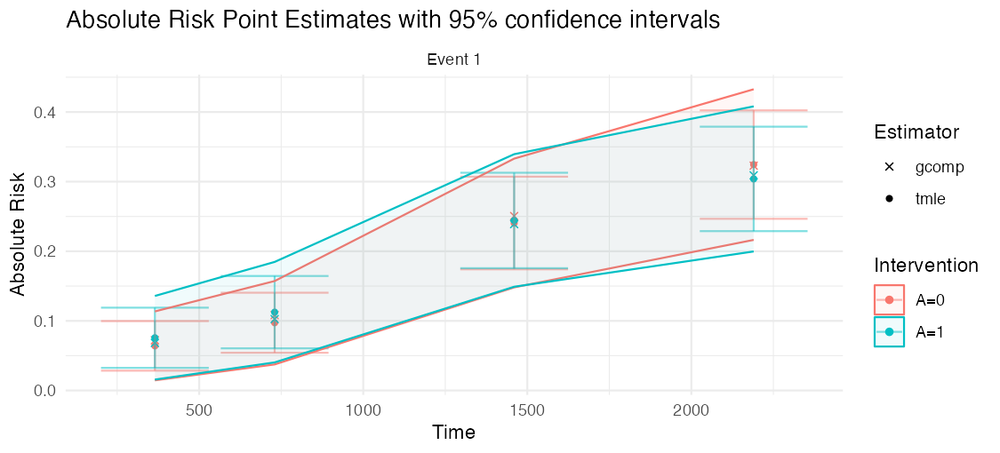
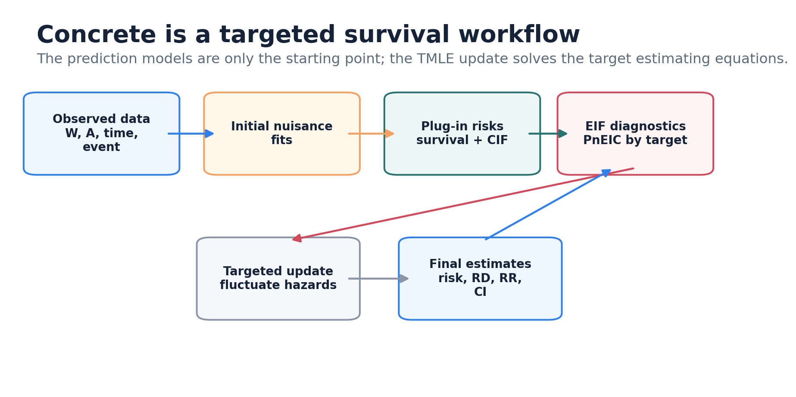

<!-- README.md is generated from README.Rmd. Please edit that file -->

# concrete 

[](http://www.r-pkg.org/pkg/concrete)
[](https://github.com/blind-contours/concrete/actions/workflows/R-CMD-check.yaml)
[](https://coveralls.io/github/blind-contours/concrete?branch=main)

> Continuous-Time Targeted Maximum Likelihood Estimation for Survival
> Analysis with Competing Risks

## Description

`concrete` is an R package designed to use targeted maximum likelihood
estimation (TMLE) to compute covariate-adjusted marginal cumulative
incidence estimates in right-censored survival settings with and without
competing risks.

`concrete` is intended to help trial analysts estimate clinically
interpretable absolute risks, risk differences, and risk ratios at
prespecified follow-up times while using flexible nuisance estimation
and TMLE diagnostics.

### What you get

The core output is a covariate-adjusted absolute-risk (cumulative
incidence) curve for each intervention, with pointwise and simultaneous
confidence intervals, plus the implied risk differences and risk ratios.
The figure below is real output from the worked PBC example used in the
[quickstart](https://blind-contours.github.io/concrete/articles/trialist-quickstart.html).



### How it works

`concrete` fits treatment and event/censoring hazards with
cross-validated learners, forms a plug-in cumulative incidence, then
applies a one-step TMLE update that targets the efficient influence
function for each requested risk. The [How concrete
works](https://blind-contours.github.io/concrete/articles/how-concrete-works.html)
article walks through each stage.



------------------------------------------------------------------------

## Installation

For standard use, we recommend installing the package from
[CRAN](https://cran.r-project.org/) via

``` r
install.packages("concrete")
```

You can install a stable release of `concrete` from GitHub via
[`devtools`](https://www.rstudio.com/products/rpackages/devtools/) with:

``` r
devtools::install_github("blind-contours/concrete")
```

------------------------------------------------------------------------

## Start here for trial analyses

If you are testing `concrete` on a randomized trial or trial-like data
set, start with these articles:

-   [Trialist
    quickstart](https://blind-contours.github.io/concrete/articles/trialist-quickstart.html):
    required data layout, a first intent-to-treat analysis, output
    interpretation, and checks to compare with standard trial summaries.
-   [Learner library
    guide](https://blind-contours.github.io/concrete/articles/learner-library.html):
    conservative Cox-only analyses, treatment Super Learner libraries,
    and the hazard learner options for Coxnet, random survival forests,
    additive hazards, and HAL.
-   [Convergence
    diagnostics](https://blind-contours.github.io/concrete/articles/convergence-diagnostics.html):
    how to inspect empirical EIC diagnostics and what to try when the
    TMLE update does not converge cleanly.
-   [Testing protocol and current
    limitations](https://blind-contours.github.io/concrete/articles/trialist-testing-protocol.html):
    a built-in smoke test, a conservative-to-flexible testing ladder,
    and the current scope of supported trial data structures.

To understand the estimator and see how it performs:

-   [How concrete
    works](https://blind-contours.github.io/concrete/articles/how-concrete-works.html):
    the target estimand, the efficient influence function, and the
    targeting loop, explained with diagrams.
-   [Simulation
    evidence](https://blind-contours.github.io/concrete/articles/simulation-evidence.html):
    bias reduction, standard-error calibration, and confidence-interval
    coverage across four simulation scenarios.

The minimum data columns are a subject id, observed time, event type,
binary treatment arm, and baseline covariates. Censoring should be coded
as `0`; event types should be positive integers. For competing risks,
use one positive integer for the event of interest and other positive
integers for competing events.

``` r
library(concrete)
library(data.table)

trial <- as.data.table(your_trial_data)

ConcreteArgs <- formatArguments(
  DataTable = trial,
  EventTime = "time",
  EventType = "event",
  Treatment = "arm",
  ID = "id",
  Intervention = makeITT(),
  TargetTime = c(365, 730),
  TargetEvent = 1,
  CVArg = list(V = 5),
  Verbose = FALSE
)

ConcreteEst <- doConcrete(ConcreteArgs)
ConcreteOut <- getOutput(
  ConcreteEst,
  Estimand = c("Risk", "RD", "RR"),
  Intervention = c(1, 2)
)

ConcreteOut
getTmleDiagnostics(ConcreteEst, type = "components")
```

### Restricted mean survival time

For a collapsible, time-scale summary that does not depend on
proportional hazards, `getRMST()` returns the covariate-adjusted
restricted mean survival time (event-free time over the horizon), the
cause-specific life-years lost, and their between-arm differences — each
with influence-function confidence intervals and a Wald p-value. (Target
every event type so the event-free RMST is identified, and use a
reasonably dense `TargetTime` grid.)

``` r
ConcreteArgs <- formatArguments(
  DataTable = trial, EventTime = "time", EventType = "event", Treatment = "arm",
  ID = "id", Intervention = makeITT(), TargetEvent = c(1, 2),
  TargetTime = c(365, 730, 1095, 1460), CVArg = list(V = 5)
)
ConcreteEst <- doConcrete(ConcreteArgs)

getRMST(ConcreteEst, Horizon = 1460, Intervention = c(1, 2))
```

Example output (PBC data, 4-year horizon; values change with your data):

| Estimand        | Event | Intervention      | Pt Est | CI Low | CI Hi | pValue |
|-----------------|------:|-------------------|-------:|-------:|------:|-------:|
| RMST            |     – | A=0               |   1270 |   1220 |  1330 |        |
| RMST            |     – | A=1               |   1270 |   1200 |  1330 |        |
| RMST Diff       |     – | \[A=1\] − \[A=0\] |   −8.1 |    −91 |    75 |   0.85 |
| Life Years Lost |     1 | A=0               |    169 |    115 |   222 |        |
| Life Years Lost |     1 | A=1               |    183 |    121 |   246 |        |
| LYL Diff        |     1 | \[A=1\] − \[A=0\] |   14.6 |    −68 |    97 |   0.73 |

`RMST Diff` is the difference in mean event-free days over the horizon
(here the arms are within \~8 days, CI −91 to 75). For sparse grids,
rare events, or long horizons, `targetRMST()` targets the RMST
estimating equation directly and is better conditioned.

``` r
targetRMST(ConcreteEst, Horizon = 1460, Intervention = c(1, 2))
```

For how this compares to the established RMST tools (`survRM2`,
`eventglm`, and `riskRegression`) — a worked toy trial with a known true
RMST, a head-to-head bias/coverage table, a capability matrix, and an
honest read on where `concrete` is at parity versus where it adds
something — see [Comparing RMST
estimators](https://blind-contours.github.io/concrete/articles/rmst-methods-comparison.html).

### Win ratio, win odds, and net benefit

For most trials the win ratio you want is the **clinical, death-priority
hierarchy**: compare a random treated patient with a random control on
the most serious event first — *counting a higher-priority event even
when it follows a lower-priority one* (death after a hospitalization, a
stroke after a hospitalization) — then break ties on the next tier.
`clinicalWinRatio()` estimates it over an arbitrary ordered hierarchy of
a terminal event (death) plus non-fatal events, with covariate-adjusted,
doubly-robust, censoring-corrected influence-function inference (a
Markov multistate model, each transition a Super Learner). Pass the
non-fatal columns in priority order:

``` r
# death > stroke > hospitalization (non-fatal columns highest-priority first)
clinicalWinRatio(trial, arm = "arm", illness.time = c("t_stroke", "t_hosp"),
  terminal.time = "t_term", terminal.status = "died",
  covariates = c("age", "sex"), horizon = 1460)
#> Win Ratio / Win Odds / Net Benefit / P(win,loss,tie), each with an IF CI
```

The first-event `getWinRatio()` is the special case for when events are
genuinely **mutually exclusive** (a higher-priority event can never
follow a lower-priority one). It works off the targeted curves and
supports a single `TargetEvent` or an ordered vector for a prioritized
hierarchy of *competing* events:

``` r
ConcreteArgs <- formatArguments(
  DataTable = trial, EventTime = "time", EventType = "event", Treatment = "arm",
  ID = "id", Intervention = makeITT(), TargetEvent = c(1, 2),
  TargetTime = c(365, 730, 1095, 1460), CVArg = list(V = 5)
)
ConcreteEst <- doConcrete(ConcreteArgs)

# single endpoint (event 1)
getWinRatio(ConcreteEst, Horizon = 1460, Intervention = c(1, 2), TargetEvent = 1)

# prioritized hierarchy: event 1 (e.g. death) outranks event 2 (e.g. hospitalization)
getWinRatio(ConcreteEst, Horizon = 1460, Intervention = c(1, 2), TargetEvent = c(1, 2))
```

Example output (single endpoint, PBC data, 4-year horizon; values change
with your data):

| Estimand    | Pt Est | CI Low | CI Hi | pValue |
|-------------|-------:|-------:|------:|-------:|
| Win Ratio   |   1.10 |   0.85 |  1.42 |   0.46 |
| Win Odds    |   1.08 |   0.89 |  1.31 |   0.44 |
| Net Benefit |  0.039 | −0.058 | 0.136 |   0.43 |
| P(win)      |  0.421 |  0.362 | 0.480 |        |
| P(loss)     |  0.382 |  0.326 | 0.438 |        |
| P(tie)      |  0.197 |  0.151 | 0.243 |        |

A **win ratio** above 1 (and a **net benefit** above 0) favors the
active arm; the win ratio’s CI crossing 1 is the test of no difference
(here \~null, in line with the RMST result). `P(win)`, `P(loss)`, and
`P(tie)` sum to 1. For a hierarchy, ties are resolved by the
lower-priority events, so `P(tie)` shrinks and the comparison uses more
of the data.

See the [Win ratios for
trialists](https://blind-contours.github.io/concrete/articles/win-ratio.html)
article for when to use the single-event, prioritized-hierarchy, and
clinical (death-priority) win ratios — the last via the experimental
`clinicalWinRatio()`, which counts death *even when it follows* a
non-fatal event — together with the simulation coverage evidence so the
inference can be trusted.

To check that your installation works before using your own data, run
the installed smoke test:

``` r
source(system.file("examples", "trialist-smoke-test.R", package = "concrete"))
```

To also try optional learners that are installed locally:

``` r
Sys.setenv(CONCRETE_RUN_OPTIONAL_LEARNERS = "true")
source(system.file("examples", "trialist-smoke-test.R", package = "concrete"))
```

## Trial-design and regulatory toolkit

Beyond absolute risk, `concrete` ships a set of estimands and robustness
analyses aimed at randomized trials and FDA / ICH E9(R1) reporting. The
[Trial-design and regulatory
toolkit](https://blind-contours.github.io/concrete/articles/regulatory-toolkit.html)
article walks through all of these on a worked example; the highlights
are:

-   **Cross-fitting (CV-TMLE).** Pass `CrossFit = TRUE` to
    `formatArguments()` to fit the propensity and hazard nuisances
    out-of-fold. This removes the empirical-process (overfitting) term
    from the remainder, which is what makes influence-function inference
    valid when the nuisances are flexible machine-learning fits.
-   **Ensemble hazard Super Learner.** `HazEnsemble = TRUE` replaces
    discrete cross-validated *selection* of a single hazard learner with
    a convex *combination* of the library, fit to minimize the
    cross-validated counting-process loss.
-   **Win ratio, win odds, and net benefit.** `getWinRatio()` turns the
    targeted survival curves into a covariate-adjusted, doubly-robust
    hierarchical comparison with influence-function confidence
    intervals.
-   **ICH E9(R1) estimands and intercurrent events.** `makeEstimand()`
    records the five estimand attributes; `applyIntercurrentEvent()`
    encodes treatment-policy, hypothetical (via censoring/IPCW), and
    composite strategies for competing or intercurrent events.
-   **Treatment switching (crossover): ITT vs per-protocol.** Pass
    `Crossover` (a column of per-subject switch times) to move from the
    intent-to-treat estimand to the hypothetical “no-switching” estimand:
    switchers are re-censored at their switch time and a *separate
    crossover hazard* is multiplied into the IPCW,
    `1 / (S_dropout * S_crossover)`, removing the selection bias of naive
    per-protocol censoring.
-   **Time-varying covariates in the censoring model.** Pass `CensoringTV`
    (long-form post-randomization measurements — echo, KCCQ, six-minute
    walk) to condition the censoring (and, by default, crossover) hazard
    on the follow-up history, correcting informative dropout. These enter
    only the censoring/crossover hazards — never the outcome model — and
    the correction flows through every IPCW-based estimand (survival,
    cumulative incidence, RMST, win ratio).
-   **Censoring sensitivity (tipping point).** `senseCensoring()` runs a
    delta-shift sensitivity analysis on the independent-censoring (MAR)
    assumption and reports where conclusions would change.
-   **Positivity diagnostics.** `getPositivityDx()` reports per-arm
    effective sample size, maximum weight, and truncation share, flagging
    when an IPCW estimand (especially the hypothetical no-switching one)
    rests on heavy extrapolation.
-   **Adjustment efficiency.** `getRelativeEfficiency()` reports the
    variance ratio of the covariate-adjusted estimator versus the
    unadjusted one.

``` r
# Cross-fitted, ensemble-hazard fit for ML-based nuisance estimation
ConcreteArgs <- formatArguments(
  DataTable = trial, EventTime = "time", EventType = "event", Treatment = "arm",
  ID = "id", Intervention = makeITT(), TargetTime = c(365, 730), TargetEvent = 1,
  CVArg = list(V = 5), CrossFit = TRUE, HazEnsemble = TRUE
)
ConcreteEst <- doConcrete(ConcreteArgs)

# Hierarchical / composite comparison
getWinRatio(ConcreteEst, Horizon = 730, Intervention = c(1, 2))

# How much did covariate adjustment buy you? Compare adjusted vs unadjusted output
getRelativeEfficiency(
  Adjusted   = getOutput(ConcreteEst,   Estimand = "RD", Intervention = c(1, 2)),
  Unadjusted = getOutput(unadjusted_est, Estimand = "RD", Intervention = c(1, 2))
)

# Sensitivity to the independent-censoring assumption: impute an increasing
# fraction (delta) of censored subjects as events and see if conclusions hold
senseCensoring(ConcreteArgs, deltas = c(0, 0.05, 0.1, 0.15, 0.2), Estimand = "RD")

# Treatment switching: intent-to-treat vs the hypothetical "no-switching" estimand.
# `switch_time` is a column of per-subject crossover times (NA if never switched);
# the crossover hazard inherits the censoring covariates (incl. CensoringTV).
pp_args <- formatArguments(
  DataTable = trial, EventTime = "time", EventType = "event", Treatment = "arm",
  ID = "id", Intervention = makeITT(), TargetTime = c(365, 730), TargetEvent = 1,
  Crossover = "switch_time"           # add CensoringTV = tv for informative dropout
)
pp_est <- doConcrete(pp_args)
getOutput(pp_est, Estimand = "RD", TargetTime = 730)  # hypothetical no-switching

# Always check positivity / effective sample size for an IPCW estimand:
getPositivityDx(pp_est)
```

## Advanced TMLE controls

The TMLE update can be configured through `formatArguments()`. The
default stopping rule is the original relative empirical EIC criterion.
For rare-event or competing-risk settings the relative threshold can
become numerically tiny, so an absolute risk-scale rule is often more
stable. A good first sensitivity is `EICStopAbsTol = 0.02 / sqrt(n)`,
which is also applied automatically if you select the `"absolute"` or
`"hybrid"` rule without setting a tolerance:

``` r
ConcreteArgs <- formatArguments(
  DataTable = data,
  EventTime = "time",
  EventType = "status",
  Treatment = "trt",
  Intervention = 0:1,
  TargetTime = c(365, 730),
  TargetEvent = 1,
  UpdateMethod = "adaptive",
  EICStopRule = "absolute",
  EICStopAbsTol = 0.02 / sqrt(nrow(data))
)
```

Use `getTmleDiagnostics()` on a fitted object to inspect final
component-wise EIC ratios, the update trace, or the norm trajectory:

``` r
ConcreteEst <- doConcrete(ConcreteArgs)
getTmleDiagnostics(ConcreteEst, type = "components")
getTmleDiagnostics(ConcreteEst, type = "trace")
```

## Survival learner library

Hazard models can mix Cox formulas with optional survival learners. The
following aliases are supported in `Model[[event_type]]`: `"coxnet"`,
`"rsf"` or `"randomForestSRC"`, `"aareg"` or `"additive_hazards"`, and
`"hal"` or `"hal9001"`.

``` r
Model <- list(
  trt = c("SL.glm", "SL.glmnet"),
  "0" = list(Cox = survival::Surv(time, status == 0) ~ .,
             RSF = "rsf",
             Aareg = "aareg"),
  "1" = list(Cox = survival::Surv(time, status == 1) ~ .,
             HAL = "hal")
)
```

The optional learners require their corresponding packages when
selected: `glmnet` for Coxnet, `randomForestSRC` for random survival
forests, and `hal9001` for HAL.

------------------------------------------------------------------------

## Issues

If you encounter any bugs or have any specific feature requests, please
[file an issue](https://github.com/blind-contours/concrete/issues).
