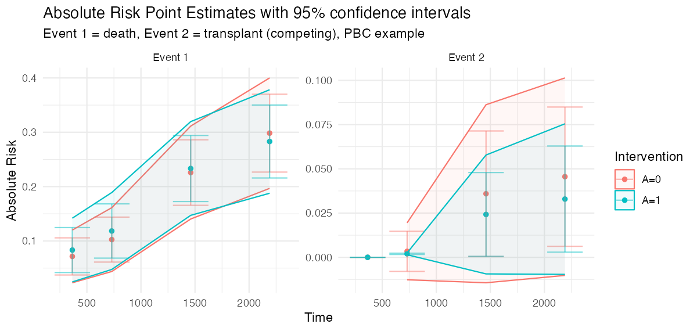
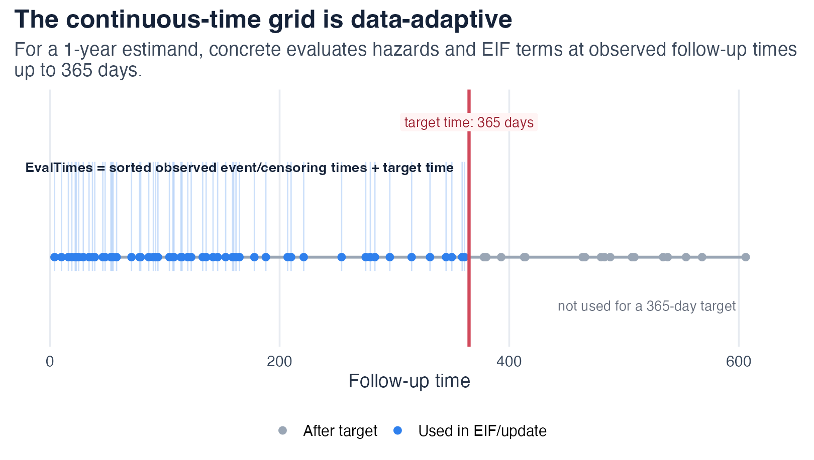
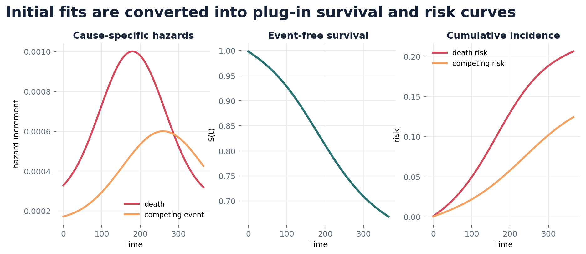
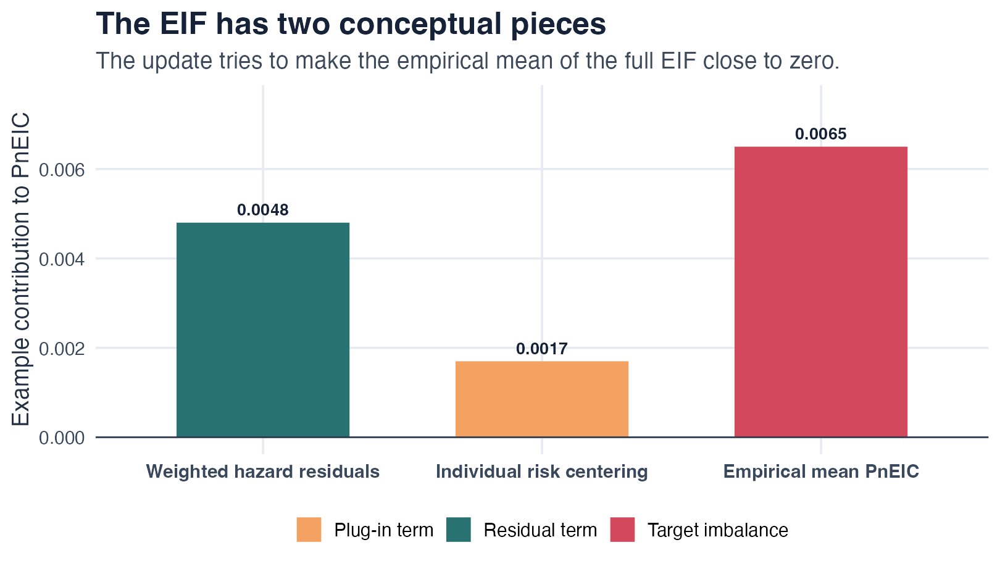
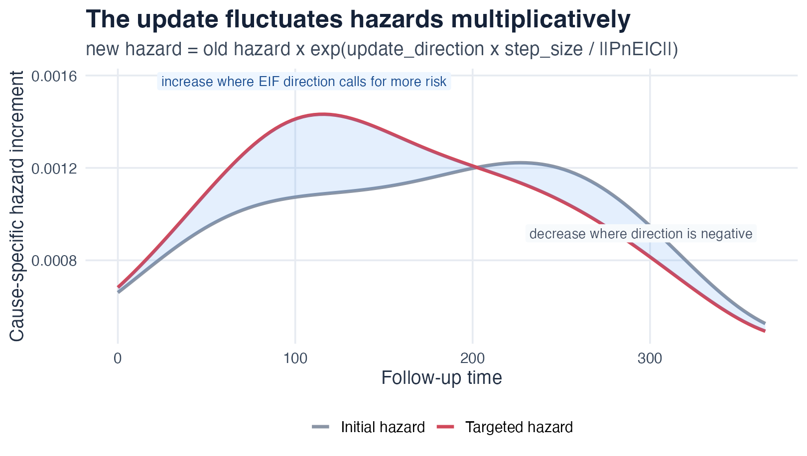
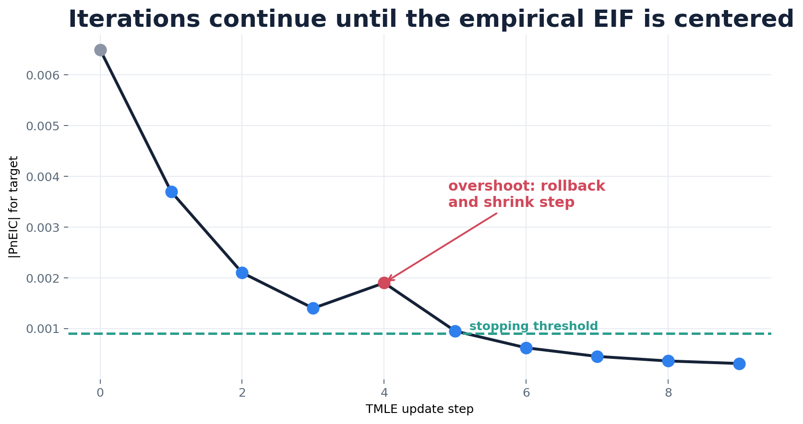
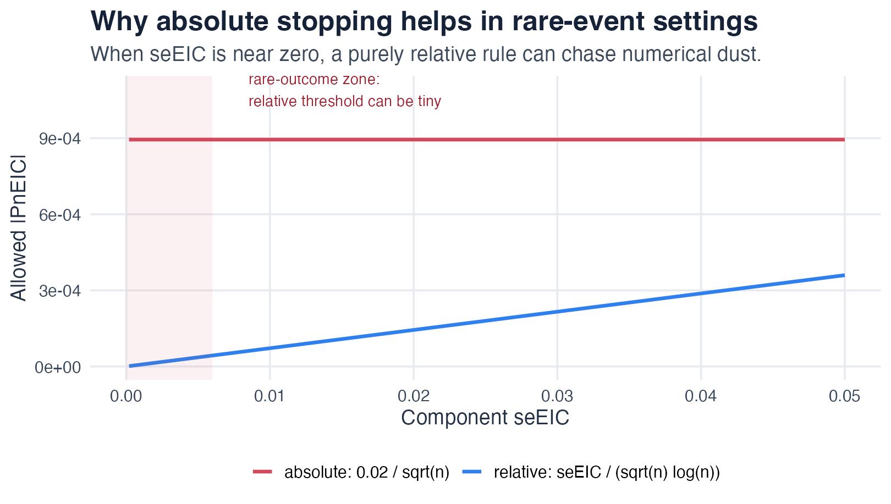

# How concrete works

This article explains what `concrete` computes and how the algorithm
gets there. It is written for analysts who want intuition for the
estimator behind the trial outputs, without reading the full methods
paper. The schematic figures below are teaching illustrations of the
algorithm, not simulation results; see the [Simulation
evidence](https://blind-contours.github.io/concrete/articles/simulation-evidence.md)
article for empirical bias and coverage.

The method is one-step continuous-time targeted minimum loss-based
estimation (TMLE) for cause-specific absolute risks, following [Rytgaard
et al. (2023)](https://doi.org/10.1111/biom.13856) and [Rytgaard and van
der Laan (2023)](https://doi.org/10.1007/s10985-022-09576-2).

## The target: a covariate-adjusted absolute risk

For a binary baseline treatment `a` and baseline covariates `W`, the
conditional cause-`j` absolute risk by time `t` is the cumulative
incidence

``` math
F_j(t \mid a, W) = \int_0^t \lambda_j(s \mid a, W)\, S(s^- \mid a, W)\, ds,
\qquad
S(t \mid a, W) = \exp\!\Big(\!-\!\int_0^t \textstyle\sum_{j=1}^J \lambda_j(s\mid a,W)\, ds\Big),
```

where $`\lambda_j`$ is the cause-`j` hazard and $`S`$ is the overall
event-free survival across all $`J`$ competing events. The trial
estimand is the marginal risk under an intervention, averaged over the
covariate distribution:

``` math
\Psi_{j,t} = \mathbb{E}_W\big[\, F_j(t \mid a, W)\, \big],
```

and from a pair of interventions `concrete` reports the **risk
difference** and **risk ratio**. Censoring is treated as a competing
event (`0`) and handled through inverse-probability-of-censoring
weighting inside the estimator, not by discarding censored subjects.

With competing risks, each event gets its own cause-specific cumulative
incidence. The figure below is real `concrete` output on the PBC
example, with death (event 1) and transplant (event 2, the competing
event) targeted jointly:



## The pipeline


`concrete` runs four stages:

1.  **Estimate nuisance parameters.** A treatment Super Learner
    estimates the propensity score `pi(a | W)`; event-specific and
    censoring hazard libraries (Cox, Coxnet, random survival forests,
    additive hazards, HAL) are fit with cross-validated selection.
2.  **Form the initial plug-in.** The hazards are turned into
    per-subject cumulative-incidence curves and averaged to a first
    estimate of each risk.
3.  **Target.** A small multiplicative update is applied to the hazards,
    repeatedly, to solve the efficient-influence-function (EIF)
    estimating equation for the requested risks.
4.  **Report.** Point estimates, influence-function standard errors, and
    pointwise plus simultaneous confidence intervals for risks,
    differences, and ratios.

## Step 1-2: an event-time grid and an initial plug-in

Continuous-time hazards are evaluated on the grid of observed
event/censoring times together with the requested target times.



Cumulating the hazards along this grid gives each subject’s plug-in
cumulative-incidence curve; averaging over subjects gives the initial
risk estimate. This plug-in is consistent only if the hazard models are
correct, and it is generally biased for the marginal risk because the
learners optimize hazard fit rather than the target.



## Step 3: the efficient influence function

TMLE removes the plug-in bias by solving the EIF estimating equation.
For target event `j` and time `t`, the EIF of each subject has three
conceptual pieces:

``` math
D^*_{j,t}(O) \;=\;
\underbrace{\sum_{l=1}^{J} \int_0^{t} h_{l,j,t}(s)\,\big(dN_l(s) - \mathbf{1}(\widetilde T \ge s)\,\lambda_l(s\mid A,W)\,ds\big)}_{\text{weighted hazard residuals}}
\;+\;
\underbrace{F_j(t \mid A, W) - \Psi_{j,t}}_{\text{individual risk centering}} .
```



The **clever covariate** $`h`$ weights each cause-`l` hazard residual by
how much that hazard, at time `s`, moves the cause-`j` risk at time `t`:

``` math
h_{l,j,t}(s) \;=\;
\frac{\pi^*(A\mid W)\,\mathbf{1}(s \le t)}{\pi(A\mid W)\, S_c(s^-\mid A, W)}
\left(\mathbf{1}(l=j) - \frac{F_j(t\mid A,W) - F_j(s\mid A,W)}{S(s\mid A,W)}\right).
```

The first factor is the treatment/censoring weight — the intervention
propensity $`\pi^*`$ over the observed propensity $`\pi`$ and the lagged
probability of remaining uncensored $`S_c(s^-)`$. The `MinNuisance`
bound is applied to this denominator to keep the weight stable under
near-positivity violations. The empirical mean of the EIF over subjects,
**PnEIC**, measures how far the current estimate is from solving the
estimating equation; the update drives it toward zero.

## Step 3: the targeting loop

`concrete` does not re-fit the hazards. It applies a single
**multiplicative fluctuation** to every cause-`l` hazard, in the
direction that most reduces the PnEIC, with a small step size
$`\varepsilon`$:

``` math
\lambda_l^{b+1}(s) \;=\; \lambda_l^{b}(s)\,
\exp\!\Big(\varepsilon\,\tfrac{\langle \mathbb{P}_n D^*,\, h_{l,\cdot}\rangle}{\lVert \mathbb{P}_n D^*\rVert}\Big).
```



After each step the survival, cumulative incidence, and EIF are
recomputed and the norm of the PnEIC is checked. The `"adaptive"` update
method backtracks the step size whenever a step would increase the
objective, so the norm decreases monotonically.



## Step 3: when to stop

The loop stops when every targeted component has a small enough PnEIC.
The **relative** rule compares `|PnEIC|` to its own standard-error
scale, `seEIC / (sqrt(n) * log(n))`. In rare-event or competing-risk
targets this threshold can become numerically tiny, so an **absolute**
rule (`|PnEIC| <= EICStopAbsTol`, default `0.02 / sqrt(n)`) is often
more stable; the **hybrid** rule takes the larger of the two.



[`getTmleDiagnostics()`](https://blind-contours.github.io/concrete/reference/getTmleDiagnostics.md)
reports, per component, the `PnEIC`, the active `StopCriteria`, their
`ratio`, and whether the `check` passed. The [Convergence
diagnostics](https://blind-contours.github.io/concrete/articles/convergence-diagnostics.md)
article shows how to read these and what to change when a fit does not
converge cleanly.

## Step 4: inference

The estimated EIF is also the basis for inference. The standard error of
each risk is the influence-function standard deviation over `sqrt(n)`.
Risk differences and risk ratios use the paired per-subject influence
functions of the two interventions (a delta-method transform for the
ratio), so the correlation between arms is accounted for. With more than
one target time, `getOutput(Simultaneous = TRUE)` adds simultaneous
confidence bands using a multiplier-bootstrap maximum over the
correlated component influence functions.

## Where to go next

- [Trialist
  quickstart](https://blind-contours.github.io/concrete/articles/trialist-quickstart.md):
  run it on your data.
- [Learner
  library](https://blind-contours.github.io/concrete/articles/learner-library.md):
  choose nuisance learners.
- [Convergence
  diagnostics](https://blind-contours.github.io/concrete/articles/convergence-diagnostics.md):
  read and fix the stopping diagnostics.
- [Simulation
  evidence](https://blind-contours.github.io/concrete/articles/simulation-evidence.md):
  empirical bias and coverage.
