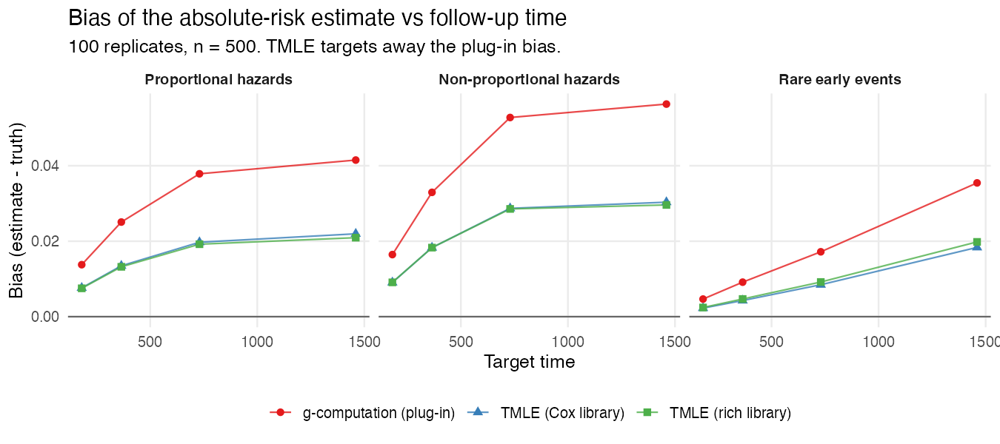
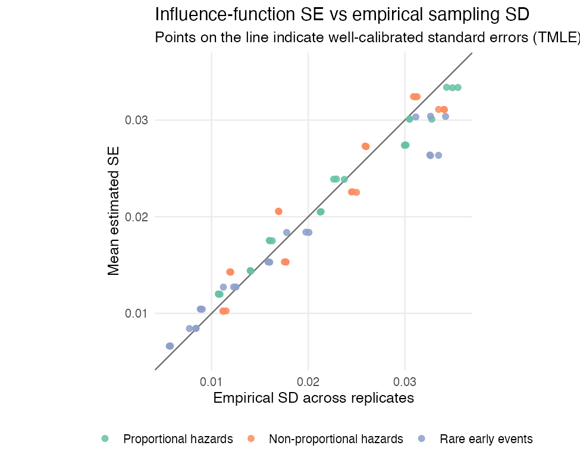
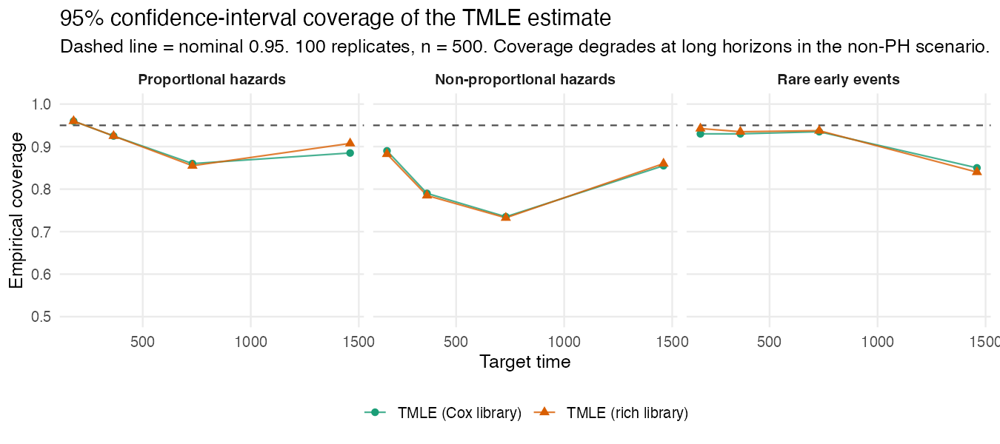
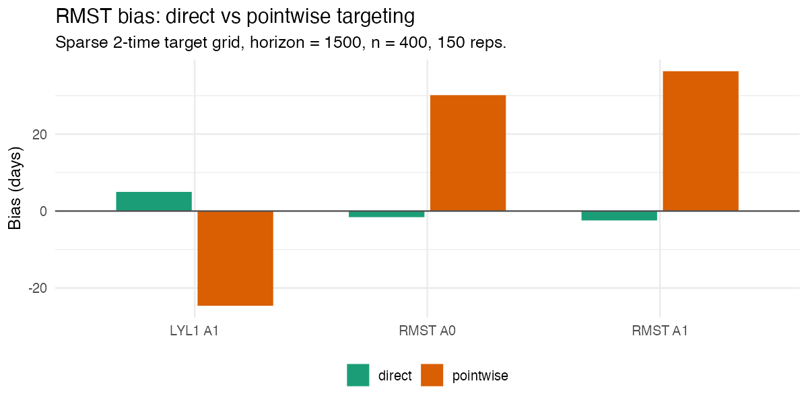

# Simulation evidence

This article summarizes how `concrete` behaves in simulations where the
truth is known. The goal is to give a trial analyst evidence on three
questions:

1.  Does the targeting step actually reduce the bias of the plug-in
    estimate?
2.  Are the influence-function standard errors trustworthy?
3.  Do the confidence intervals cover the truth at the nominal rate?

The figures are generated from the package’s committed
referee-simulation results by `scripts/make-sim-evidence-figures.R`; the
simulations themselves are in `scripts/sim-data/referee-sims/` and are
reproducible from a fixed seed grid.

## The scenarios

Each scenario simulates continuous-time data with two competing events
plus censoring, a binary baseline treatment, and five baseline
covariates. The headline figures use 100 replicates at n = 500.

| Scenario | What it stresses |
|----|----|
| Proportional hazards | Well-specified, Cox-compatible baseline |
| Non-proportional hazards | Time-varying treatment/covariate effects |
| Rare early events | Low early event rate, hard early target times |
| Positivity / informative censoring | Treatment imbalance and informative censoring |

## Result 1: TMLE reduces the plug-in bias

The g-computation plug-in (red) inherits the bias of the hazard fit and
drifts further from the truth as follow-up lengthens. The one-step TMLE
update (blue, green) targets that bias away. Averaged over scenarios and
target times, the mean absolute bias falls from about **0.029** for the
plug-in to about **0.015** for TMLE — roughly a halving — and the two
TMLE libraries (Cox-only vs a richer learner library) behave similarly
here.



## Result 2: the standard errors are well calibrated

A standard error is trustworthy if, across replicates, the mean
estimated SE matches the empirical standard deviation of the point
estimates. For the TMLE absolute-risk estimates these track the identity
line closely — the mean ratio of estimated SE to empirical SD is about
**1.01**.



## Result 3: coverage is near-nominal, with a caveat at long horizons

Coverage is close to the nominal 95% at short and medium target times.
At the **longest horizons in the non-proportional-hazards scenario** it
degrades: this is where a small residual finite-sample bias is largest
relative to the standard error, so the interval is centered slightly
off. This is the expected behavior of a one-step estimator at finite n,
and it is the practical reason to (a) inspect
[`getTmleDiagnostics()`](https://blind-contours.github.io/concrete/reference/getTmleDiagnostics.md),
(b) prefer a richer hazard library when proportional hazards is
implausible, and (c) interpret very-long-horizon estimates cautiously.



Adding the positivity / informative-censoring scenario (20 replicates,
so coverage is noisier) shows the same qualitative picture across all
four settings:


## Direct vs pointwise RMST targeting

`concrete` offers two ways to estimate the restricted mean survival
time:
[`getRMST()`](https://blind-contours.github.io/concrete/reference/getRMST.md)
integrates the pointwise-targeted absolute risks, while
[`targetRMST()`](https://blind-contours.github.io/concrete/reference/targetRMST.md)
fluctuates the hazards to solve the RMST estimating equation directly
(see the [How concrete
works](https://blind-contours.github.io/concrete/articles/how-concrete-works.md)
article). The simulation below uses exponential cause-specific hazards
(so the true RMST and life-years-lost have closed forms) and a
deliberately **sparse two-time target grid**, which is where the
difference shows up.

The direct method substantially reduces bias, because it integrates over
the full event-time grid and targets the RMST functional itself rather
than relying on a crude trapezoid of a few targeted risks:



That lower bias translates into confidence-interval coverage closer to
nominal:


With a dense target grid the two approaches converge; the direct method
is the one to prefer for sparse grids, rare events, and long horizons.

## Result 4: type-I error is nominal under the null

Effect-scenario coverage says little about what happens when there is
nothing to find, so the core absolute-risk TMLE was run on a null DGP —
two competing events plus censoring, with a treatment that affects
**neither** cause (160 replicates, n = 500 per arm, target time inside
the follow-up horizon):

| Quantity                                                 | Value     |
|----------------------------------------------------------|-----------|
| Type-I error of the risk-difference Wald test (α = 0.05) | **0.050** |
| Risk-difference coverage at the true value 0             | **0.950** |
| SE calibration (empirical SD / mean IF-SE)               | 0.98      |
| Per-arm absolute-risk bias                               | ≤ 0.003   |

The Wald test rejects a true null at exactly its nominal rate, which is
the property a primary-endpoint analysis has to have.

## Result 5: standard errors under stratified randomization

Most phase-3 trials randomize within strata using permuted blocks, and
the usual iid influence-function variance is then conservative — it
ignores the between-arm-within-stratum variance the design removes.
Passing the randomization strata via `Strata` applies the
Bugni–Canay–Shaikh / Ye–Shao correction to every reported standard
error. The validation (150 replicates per cell, n = 600, permuted blocks
of 4 within 4 prognostic strata) checks the three behaviors the theory
predicts:

| Cell | empirical SD / mean SE (iid) | (strata-corrected) | Coverage |
|----|----|----|----|
| Models **unadjusted** for the stratum | 0.82 (conservative) | 0.88 | 0.98 |
| Models **adjusted** for the stratum | 0.86 | 0.86 (correction ≈ 0) | 0.97 |
| Simple-randomization control | 0.81 | — | 0.98 |

The correction tightens the SEs exactly when the working models do not
absorb the stratification, reduces to the iid SE (to four decimals) when
they do, and never went anti-conservative. The simple-randomization
control attributes the residual conservatism to small-sample behavior
common to all cells, not to the correction.

## Takeaways for a trial analysis

- The targeting step is doing real work: it consistently reduces the
  plug-in bias, which is the reason to use TMLE rather than a plain
  g-formula plug-in.
- Influence-function standard errors are reliable, so the reported
  intervals are meaningful — and the type-I error of the risk-difference
  test is nominal under the null.
- If randomization was stratified, pass `Strata`: the corrected standard
  errors recover precision the iid variance gives away, and reduce to
  the iid answer when the models already adjust for the strata.
- Trust short-to-medium-horizon estimates most; at long horizons under
  likely non-proportional hazards, lean on the diagnostics and a
  flexible hazard library, and report the convergence status.

## Reproducing these figures

``` r

# Re-plot from the committed simulation summaries (no simulation is run):
source("scripts/make-sim-evidence-figures.R")

# Re-run the simulations themselves (heavy; uses a fixed seed grid):
# see scripts/sim-data/referee-sims/run_pilot.R

# The direct-vs-pointwise RMST comparison (closed-form truth) is self-contained:
# Rscript scripts/make-rmst-comparison.R 150 400

# The null / type-I validation and the stratified-randomization SE validation
# are self-contained (closed-form or mega-MC truths, fixed seeds):
# Rscript scripts/dev-null-typeI.R
# Rscript scripts/dev-strata-validation.R
# Rscript scripts/dev-strata-control.R
```
