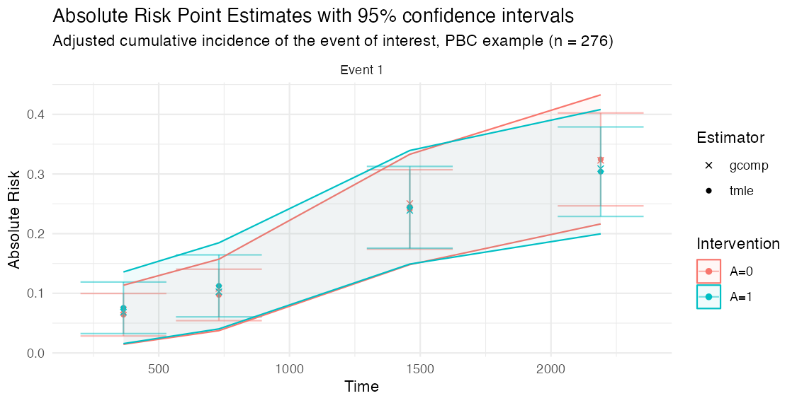

# Trialist quickstart

This article is written for trial analysts who want to test `concrete`
on a randomized trial or trial-like observational data set. The core
output is a covariate-adjusted marginal absolute risk at prespecified
follow-up times. From those risks, `concrete` reports risk differences
and risk ratios.

## What question is being answered?

For a binary baseline treatment, `concrete` estimates counterfactual
absolute risks such as:

- risk of event 1 by day 365 if everyone followed the active arm
- risk of event 1 by day 365 if everyone followed the control arm
- active minus control risk difference
- active divided by control risk ratio

For competing risks, the estimate is the cumulative incidence of the
target event in the presence of the competing events. For a standard
right-censored survival endpoint with no competing risks, use one
positive event code and code censoring as `0`.

## Data checklist

Your analysis data set should have one row per participant for the
current package interface.

| Item       | Requirement                                         |
|------------|-----------------------------------------------------|
| Subject id | Unique participant id column                        |
| Time       | Observed event or censoring time, numeric, positive |
| Event type | `0` for censoring, positive integers for events     |
| Treatment  | Binary baseline treatment coded `0` and `1`         |
| Covariates | Baseline covariates measured before treatment       |

Check these before fitting:

``` r

trial[, .N, by = event]
trial[, .N, by = .(arm, event)]
summary(trial$time)
stopifnot(all(trial$event >= 0))
stopifnot(all(trial$arm %in% c(0, 1)))
```

Current scope:

- baseline binary treatment
- one row per participant
- right-censored event time data
- optional competing risks
- baseline covariate adjustment

Currently out of scope:

- longitudinal treatment regimes
- recurrent events
- left truncation or delayed entry
- non-binary treatment without custom intervention work

## Example data

The examples below use
[`survival::pbc`](https://rdrr.io/pkg/survival/man/pbc.html) only to
provide a complete data shape. Replace this block with your trial data.

``` r

library(concrete)
library(data.table)

trial <- as.data.table(survival::pbc)
trial <- trial[!is.na(trt), .(id, time, status, trt, age, sex, albumin, bili)]

# Example treatment coding: 1 = active arm, 0 = control arm.
trial[, arm := as.integer(trt == 2)]

# Example competing-risk coding:
# 0 = censored, 1 = death, 2 = transplant.
trial[, event := data.table::fifelse(
  status == 2, 1L,
  data.table::fifelse(status == 1, 2L, 0L)
)]

trial <- trial[, .(id, time, event, arm, age, sex, albumin, bili)]
```

Before fitting your own data, you can run the installed smoke test:

``` r

source(system.file("examples", "trialist-smoke-test.R", package = "concrete"))
```

This verifies that the package can run a small competing-risk analysis
and prints the same kinds of outputs and diagnostics you should inspect
in your trial.

## First intent-to-treat analysis

Start with a conservative analysis before adding flexible hazard
learners. This uses the default treatment Super Learner and default Cox
candidate hazards.

``` r

ConcreteArgs <- formatArguments(
  DataTable = trial,
  EventTime = "time",
  EventType = "event",
  Treatment = "arm",
  ID = "id",
  Intervention = makeITT(),
  TargetTime = c(365, 730, 1095),
  TargetEvent = 1,
  CVArg = list(V = 5),
  Verbose = FALSE
)

ConcreteEst <- doConcrete(ConcreteArgs)
print(ConcreteEst)
```

[`makeITT()`](https://blind-contours.github.io/concrete/reference/formatArguments.md)
creates two static interventions:

- `A=1`: everyone assigned to the active arm
- `A=0`: everyone assigned to the control arm

This is the usual starting point for an intent-to-treat comparison when
the treatment column is the randomized treatment assignment.

## Output for a trial report

``` r

ConcreteOut <- getOutput(
  ConcreteEst,
  Estimand = c("Risk", "RD", "RR"),
  Intervention = c(1, 2),
  GComp = TRUE,
  Simultaneous = TRUE
)

ConcreteOut[Event == 1]
```

The table below is the actual TMLE output from this PBC example (event
of interest, selected target times). The exact values will change with
your data, target times, learner library, and confidence-interval
settings.

|     | Time | Event |  Estimand |      Intervention | Estimator | Pt Est |    se | CI Low | CI Hi |
|:----|-----:|------:|----------:|------------------:|----------:|-------:|------:|-------:|------:|
| 9   |  730 |     1 |  Abs Risk |               A=0 |      tmle |  0.097 | 0.022 |  0.054 | 0.140 |
| 11  |  730 |     1 |  Abs Risk |               A=1 |      tmle |  0.112 | 0.027 |  0.061 | 0.164 |
| 13  |  730 |     1 |  Rel Risk | \[A=1\] / \[A=0\] |      tmle |  1.156 | 0.378 |  0.416 | 1.896 |
| 15  |  730 |     1 | Risk Diff | \[A=1\] - \[A=0\] |      tmle |  0.015 | 0.034 | -0.052 | 0.083 |
| 17  | 1460 |     1 |  Abs Risk |               A=0 |      tmle |  0.241 | 0.034 |  0.174 | 0.307 |
| 19  | 1460 |     1 |  Abs Risk |               A=1 |      tmle |  0.244 | 0.035 |  0.176 | 0.313 |
| 21  | 1460 |     1 |  Rel Risk | \[A=1\] / \[A=0\] |      tmle |  1.015 | 0.204 |  0.615 | 1.416 |
| 23  | 1460 |     1 | Risk Diff | \[A=1\] - \[A=0\] |      tmle |  0.004 | 0.049 | -0.092 | 0.099 |
| 25  | 2190 |     1 |  Abs Risk |               A=0 |      tmle |  0.325 | 0.040 |  0.247 | 0.402 |
| 27  | 2190 |     1 |  Abs Risk |               A=1 |      tmle |  0.304 | 0.038 |  0.229 | 0.379 |
| 29  | 2190 |     1 |  Rel Risk | \[A=1\] / \[A=0\] |      tmle |  0.937 | 0.165 |  0.614 | 1.259 |
| 31  | 2190 |     1 | Risk Diff | \[A=1\] - \[A=0\] |      tmle | -0.021 | 0.055 | -0.129 | 0.088 |

`plot(ConcreteOut)` draws the same estimates as covariate-adjusted
absolute-risk curves by arm, with pointwise error bars and a shaded
simultaneous confidence band:

``` r

plot(ConcreteOut, ask = FALSE)
```



Important columns:

- `Time`: target follow-up time
- `Event`: target event code
- `Estimand`: absolute risk, risk difference, or relative risk
- `Intervention`: intervention being estimated or compared
- `Estimator`: `tmle` or optional `gcomp` plug-in estimate
- `Pt Est`: point estimate
- `CI Low`, `CI Hi`: confidence interval

For risk differences, positive values mean the first intervention listed
in `Intervention = c(1, 2)` has higher risk than the second. With
[`makeITT()`](https://blind-contours.github.io/concrete/reference/formatArguments.md),
that is `A=1` minus `A=0`.

[`getOutput()`](https://blind-contours.github.io/concrete/reference/getOutput.md)
also reports a two-sided Wald `pValue` for the risk difference and risk
ratio, and can run a one-sided non-inferiority assessment against a
margin:

``` r

getOutput(
  ConcreteEst, Estimand = "RD", Intervention = c(1, 2),
  NIMargin = 0.05, NIDirection = "upper"   # active is non-inferior if its excess risk stays below 0.05
)
```

## Restricted mean survival time and life-years lost

Because the hazard ratio is non-collapsible and depends on proportional
hazards, many trials report a restricted mean survival time (RMST)
instead.
[`getRMST()`](https://blind-contours.github.io/concrete/reference/getRMST.md)
integrates the targeted cumulative incidence over the follow-up horizon,
so request a reasonably dense `TargetTime` grid when you plan to use it.

``` r

# RMST (event-free time) and cause-specific life-years lost, with the
# between-arm difference in restricted mean times:
getRMST(ConcreteEst, Horizon = 1095, Intervention = c(1, 2))
```

The `RMST Diff` row is the difference in mean event-free time up to the
horizon (e.g. “extra days alive and event-free under the active arm”);
`LYL Diff` rows are the cause-specific differences in time lost.

[`getRMST()`](https://blind-contours.github.io/concrete/reference/getRMST.md)
integrates the pointwise-targeted risks, so it needs a reasonably dense
`TargetTime` grid. If you only fit a few target times, or you have rare
events or a long horizon,
[`targetRMST()`](https://blind-contours.github.io/concrete/reference/targetRMST.md)
targets the RMST estimating equation **directly** (fluctuating the
hazards for the integrated clever covariate) and is better conditioned:

``` r

targetRMST(ConcreteEst, Horizon = 1095, Intervention = c(1, 2))
```

## How much did covariate adjustment buy you?

Covariate adjustment does not change the estimand in a randomized trial,
but it can tighten the confidence intervals. Fit an unadjusted
(treatment-only) version and compare with
[`getRelativeEfficiency()`](https://blind-contours.github.io/concrete/reference/getRelativeEfficiency.md):

``` r

unadj_args <- formatArguments(
  DataTable = trial, EventTime = "time", EventType = "event", Treatment = "arm",
  ID = "id", Intervention = makeITT(), TargetTime = c(365, 730, 1095),
  TargetEvent = 1, CVArg = list(V = 5),
  Model = list(arm = "SL.mean",
               "0" = list(Cox = survival::Surv(time, event == 0) ~ arm),
               "1" = list(Cox = survival::Surv(time, event == 1) ~ arm))
)
unadj_est <- doConcrete(unadj_args)

getRelativeEfficiency(
  Adjusted   = getOutput(ConcreteEst, Estimand = c("Risk", "RD"), Intervention = c(1, 2)),
  Unadjusted = getOutput(unadj_est,   Estimand = c("Risk", "RD"), Intervention = c(1, 2))
)
```

`RelEfficiency` above 1 and a positive `VarReductionPct` mean adjustment
was worth it: a value of 1.25 says the adjusted analysis on these `n`
participants has the precision of an unadjusted analysis on 25% more.

## Compare with familiar analyses

Use standard analyses as context, not as exact substitutes. A Cox hazard
ratio is not the same estimand as a marginal risk difference or
cumulative incidence risk ratio.

``` r

# Event counts by arm are always the first check.
trial[, .N, by = .(arm, event)]

# Cause-specific Cox model for the event of interest.
cox_event1 <- survival::coxph(
  survival::Surv(time, event == 1) ~ arm + age + sex + albumin + bili,
  data = trial
)
summary(cox_event1)

# Kaplan-Meier style context for a non-competing-risk endpoint.
# For competing risks, prefer a cumulative incidence estimator in your usual
# trial reporting workflow and compare target times to ConcreteOut.
km_event1 <- survival::survfit(
  survival::Surv(time, event == 1) ~ arm,
  data = trial
)
summary(km_event1, times = c(365, 730, 1095))
```

Useful comparison questions:

- Are event counts and censoring patterns plausible by treatment arm?
- Are `concrete` absolute risks close to unadjusted estimates in a
  balanced trial?
- Do adjusted estimates move in the expected direction when important
  prognostic covariates are included?
- Are the TMLE estimates and g-computation plug-in estimates close?
- Are confidence intervals wider in rare-event settings?

## Check convergence

``` r

components <- getTmleDiagnostics(ConcreteEst, type = "components")
components[order(ratio, decreasing = TRUE)][1:10]

trace <- getTmleDiagnostics(ConcreteEst, type = "trace")
trace
```

For a clean fit, the component diagnostics should have `check = TRUE`
for all targeted components under the selected stopping rule. A compact
success summary from the smoke test looks like:

| analysis | status | converged | step | max_ratio | failing_components |
|----------|--------|-----------|-----:|----------:|-------------------:|
| cox_only | ok     | TRUE      |    4 |     0.743 |                  0 |

If the fit does not converge, try the settings in the convergence
diagnostics article before changing the estimand.

``` r

ConcreteArgs$UpdateMethod <- "adaptive"
ConcreteArgs$EICStopRule <- "absolute"
ConcreteArgs$EICStopAbsTol <- 0.02 / sqrt(nrow(ConcreteArgs$Data))
ConcreteArgs <- formatArguments(ConcreteArgs)

ConcreteEst <- doConcrete(ConcreteArgs)
getTmleDiagnostics(ConcreteEst, type = "components")
```

## What to share when testing

When sharing results with collaborators or opening a GitHub issue,
include:

- package version from `packageVersion("concrete")`
- event counts by treatment arm
- target event and target time
- learner library used in `Model`
- TMLE controls: `UpdateMethod`, `EICStopRule`, `EICStopAbsTol`
- `getTmleDiagnostics(ConcreteEst, type = "components")`
- whether the issue reproduces with the conservative Cox-only analysis
