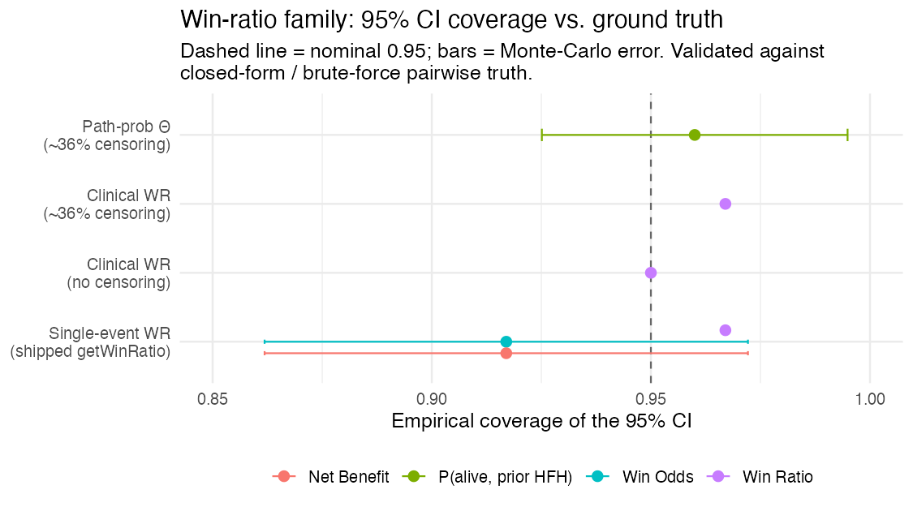

# Win ratios for trialists: single, hierarchical, and clinical

The **win ratio** compares two treatment arms by, in effect, playing
every treated patient against every control patient and asking who does
better. It is popular for composite and hierarchical endpoints
(e.g. cardiovascular death and heart-failure hospitalization) and under
non-proportional hazards, where the hazard ratio is hard to interpret.
`concrete` provides three versions, all built as smooth functionals of
the **targeted counterfactual survival / cumulative- incidence curves**
it already estimates — so unlike the standard pairwise win ratio, they
are **covariate-adjusted, doubly-robust, and censoring-corrected**, with
influence-function confidence intervals.

This article explains the three, when to use each, and shows the
simulation evidence that they are calibrated.

## 1. Single endpoint

For one time-to-event outcome,
[`getWinRatio()`](https://blind-contours.github.io/concrete/reference/getWinRatio.md)
reports the restricted win ratio, win odds, and net benefit over
`[0, Horizon]`: a treated patient *wins* if the control has the event
first (within the horizon), *loses* if the treated has it first, and
*ties* otherwise.

``` r

library(concrete)
ConcreteEst <- doConcrete(formatArguments(
  DataTable = trial, EventTime = "time", EventType = "event", Treatment = "arm",
  ID = "id", Intervention = makeITT(), TargetTime = c(180, 365, 545, 730),
  TargetEvent = 1, CVArg = list(V = 5)))

getWinRatio(ConcreteEst, Horizon = 730, Intervention = c(1, 2))
#> Win Ratio, Win Odds, Net Benefit, P(win), P(loss), P(tie) -- each with a CI
```

## 2. Hierarchical (prioritized) endpoints

Give `TargetEvent` an **ordered** vector (highest priority first) and
the comparison becomes hierarchical (Pocock / Finkelstein–Schoenfeld):
decide each pair on the top-priority event; only if that ties, move to
the next.

``` r

# event 1 (e.g. death) outranks event 2 (e.g. hospitalization)
getWinRatio(ConcreteEst, Horizon = 730, Intervention = c(1, 2), TargetEvent = c(1, 2))
```

This version compares each patient’s **first** event, treating the
listed events as competing risks (the structure `concrete` models). It
is exact and fast, but note the consequence: a patient hospitalized
**and then** dying is recorded by their first event (the
hospitalization), so their later death is not used. When death after a
non-fatal event matters, use the clinical win ratio below.

## 3. Clinical (death-priority) hierarchical win ratio — **the one you usually want** (experimental)

[`clinicalWinRatio()`](https://blind-contours.github.io/concrete/reference/clinicalWinRatio.md)
targets the win ratio cardiologists actually mean: **compare on the most
serious event first — counting a higher-priority event even when it
follows a lower-priority one — then break ties on the next tier.** Death
counts even after a hospitalization; a stroke counts even after a
hospitalization. This is the clinically intended hierarchy, and it is
the win ratio the first-event version (§1–2) cannot produce.

It handles an **arbitrary ordered hierarchy** of a terminal event
(death) plus one or more non-fatal events. Internally it is a Markov
multistate model whose states are the subsets of non-fatal events a
subject has experienced; every transition (each non-fatal event out of
each reachable state, and death out of every state) is a Super Learner,
with doubly-robust, covariate-adjusted, censoring-corrected (IPCW)
influence-function inference and optional cross-fitting. Pass the
non-fatal event columns **in priority order** (highest first); a single
column is the two-tier illness–death case.

``` r

# Two-tier (death > hospitalization):
clinicalWinRatio(trial, arm = "arm", illness.time = "t_hosp",
  terminal.time = "t_term", terminal.status = "died",
  covariates = c("age", "sex"), horizon = 1460)

# Three-tier hierarchy (death > stroke > hospitalization):
clinicalWinRatio(trial, arm = "arm", illness.time = c("t_stroke", "t_hosp"),
  terminal.time = "t_term", terminal.status = "died",
  covariates = c("age", "sex"), horizon = 1460)
#> Win Ratio / Win Odds / Net Benefit / P(win,loss,tie), each with an IF CI
```

## Can you trust it? Simulation evidence

Every version is validated against **ground truth** — closed-form path
probabilities and a brute-force pairwise win ratio computed on full
simulated histories (which counts death-after-non-fatal correctly).
Across the win-ratio family, the 95% influence-function confidence
intervals cover at the nominal rate:



And the clinical (death-priority) win ratio recovers the brute-force
pairwise truth essentially exactly, with and without censoring:


(Reproduce with `scripts/make-winratio-coverage.R`,
`scripts/make-clinical-wr-censoring-validation.R`, and the other
`scripts/make-clinical-wr-*.R`.)

### A note on small trials

The win ratio is a **ratio**, and ratios are mildly biased and
anti-conservative in small samples — this is a well-known finite-sample
property of the win ratio (it affects the unadjusted Pocock win ratio
too), not something specific to this estimator. In a null simulation
(both arms identical, true win ratio 1), the point estimate is biased
downward by about 1% at ~400/arm, with 95% Wald coverage near 0.93–0.94
and type-I error near 0.06–0.07. The effect shrinks at the usual `1/n`
rate: by ~800/arm the bias is negligible and coverage is nominal
(0.95–0.97).


Importantly, this is a property of the win-ratio *functional*, not of
the machine-learning nuisances: turning on **cross-fitting**
(`n.folds = 5`, the default) does not change it. Cross-fitting is still
worth keeping on — it gives honest inference when `SL.library` contains
flexible learners that could over-fit in sample — but for a small trial,
read the interval as mildly optimistic, or use a resampling interval.
(Reproduce with `scripts/make-clinical-wr-smalln.R`.)

## Which one should I use?

| Situation | Use |
|----|----|
| **Prioritized clinical hierarchy (death \> … \> non-fatal events) — most trials** | **[`clinicalWinRatio()`](https://blind-contours.github.io/concrete/reference/clinicalWinRatio.md)** |
| A higher-priority event can follow a lower-priority one (death after a hospitalization; stroke after a hospitalization) | [`clinicalWinRatio()`](https://blind-contours.github.io/concrete/reference/clinicalWinRatio.md) |
| One time-to-event endpoint | [`getWinRatio()`](https://blind-contours.github.io/concrete/reference/getWinRatio.md) (single `TargetEvent`) |
| Prioritized endpoints where first events are genuinely **mutually exclusive** | [`getWinRatio()`](https://blind-contours.github.io/concrete/reference/getWinRatio.md) (ordered `TargetEvent`) |

**Start with
[`clinicalWinRatio()`](https://blind-contours.github.io/concrete/reference/clinicalWinRatio.md)**
— it is the clinically correct hierarchy and what most
composite/win-ratio endpoints (e.g. TRILUMINATE, TRISCEND II) actually
mean. Reach for the first-event
[`getWinRatio()`](https://blind-contours.github.io/concrete/reference/getWinRatio.md)
only when a higher-priority event can never follow a lower-priority one.
In all cases a win ratio above 1 (and net benefit above 0) favors the
active arm, and the win ratio’s CI crossing 1 is the test of no
difference.

## Caveats

- **[`clinicalWinRatio()`](https://blind-contours.github.io/concrete/reference/clinicalWinRatio.md)
  is experimental.** It uses its own per-subject event columns (not yet
  the \[formatArguments()\] pipeline), and assumes **non-recurrent**
  events, **conditionally-independent censoring** (CAR), and a
  **Markov** multistate model. The estimand and its influence-function
  inference are validated against brute-force ground truth for
  hierarchies up to four time-to-event tiers. Recurrent-event tiers
  (repeated hospitalizations) and continuous/ordinal tiers (e.g. KCCQ)
  are not yet supported.
- Use a reasonably dense time grid (`n.grid`); like RMST, the
  path-probability integrals carry a small grid-discretization bias that
  shrinks with the grid.
- In **small trials** the win ratio is mildly anti-conservative (see *A
  note on small trials* above) — a finite-sample property of the win
  ratio that is nominal by ~1000–2000/arm and is not fixed by
  cross-fitting.
- For the single/hierarchical versions, use a reasonably dense
  `TargetTime` grid up to the horizon. \`\`\`
