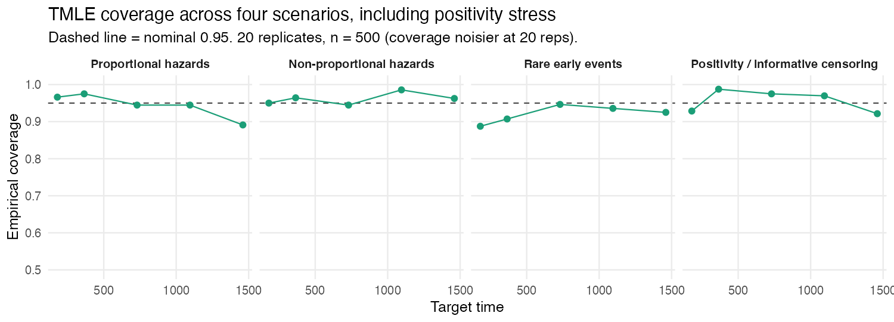

```{r, include = FALSE}
knitr::opts_chunk$set(collapse = TRUE, comment = "#>", echo = TRUE, eval = FALSE)
```

This article summarizes how `concrete` behaves in simulations where the truth is
known. The goal is to give a trial analyst evidence on three questions:

1. Does the targeting step actually reduce the bias of the plug-in estimate?
2. Are the influence-function standard errors trustworthy?
3. Do the confidence intervals cover the truth at the nominal rate?

The figures are generated from the package's committed referee-simulation
results by `scripts/make-sim-evidence-figures.R`; the simulations themselves are
in `scripts/sim-data/referee-sims/` and are reproducible from a fixed seed grid.

## The scenarios

Each scenario simulates continuous-time data with two competing events plus
censoring, a binary baseline treatment, and five baseline covariates. The
headline figures use 100 replicates at n = 500.

| Scenario | What it stresses |
|---|---|
| Proportional hazards | Well-specified, Cox-compatible baseline |
| Non-proportional hazards | Time-varying treatment/covariate effects |
| Rare early events | Low early event rate, hard early target times |
| Positivity / informative censoring | Treatment imbalance and informative censoring |

## Result 1: TMLE reduces the plug-in bias

The g-computation plug-in (red) inherits the bias of the hazard fit and drifts
further from the truth as follow-up lengthens. The one-step TMLE update (blue,
green) targets that bias away. Averaged over scenarios and target times, the
mean absolute bias falls from about **0.029** for the plug-in to about
**0.015** for TMLE — roughly a halving — and the two TMLE libraries (Cox-only
vs a richer learner library) behave similarly here.

```{r, echo = FALSE, eval = TRUE, out.width = "100%", fig.alt = "bias vs time"}
knitr::include_graphics("figures/sim-bias-vs-time.png")
```

## Result 2: the standard errors are well calibrated

A standard error is trustworthy if, across replicates, the mean estimated SE
matches the empirical standard deviation of the point estimates. For the TMLE
absolute-risk estimates these track the identity line closely — the mean ratio
of estimated SE to empirical SD is about **1.01**.

```{r, echo = FALSE, eval = TRUE, out.width = "65%", fig.alt = "SE calibration"}
knitr::include_graphics("figures/sim-se-calibration.png")
```

## Result 3: coverage is near-nominal, with a caveat at long horizons

Coverage is close to the nominal 95% at short and medium target times. At the
**longest horizons in the non-proportional-hazards scenario** it degrades:
this is where a small residual finite-sample bias is largest relative to the
standard error, so the interval is centered slightly off. This is the expected
behavior of a one-step estimator at finite n, and it is the practical reason to
(a) inspect `getTmleDiagnostics()`, (b) prefer a richer hazard library when
proportional hazards is implausible, and (c) interpret very-long-horizon
estimates cautiously.

```{r, echo = FALSE, eval = TRUE, out.width = "100%", fig.alt = "coverage vs time"}
knitr::include_graphics("figures/sim-coverage.png")
```

Adding the positivity / informative-censoring scenario (20 replicates, so
coverage is noisier) shows the same qualitative picture across all four
settings:

```{r, echo = FALSE, eval = TRUE, out.width = "100%", fig.alt = "coverage four scenarios"}

```

## Takeaways for a trial analysis

- The targeting step is doing real work: it consistently reduces the plug-in
  bias, which is the reason to use TMLE rather than a plain g-formula plug-in.
- Influence-function standard errors are reliable, so the reported intervals are
  meaningful.
- Trust short-to-medium-horizon estimates most; at long horizons under likely
  non-proportional hazards, lean on the diagnostics and a flexible hazard
  library, and report the convergence status.

## Reproducing these figures

```{r repro}
# Re-plot from the committed simulation summaries (no simulation is run):
source("scripts/make-sim-evidence-figures.R")

# Re-run the simulations themselves (heavy; uses a fixed seed grid):
# see scripts/sim-data/referee-sims/run_pilot.R
```
